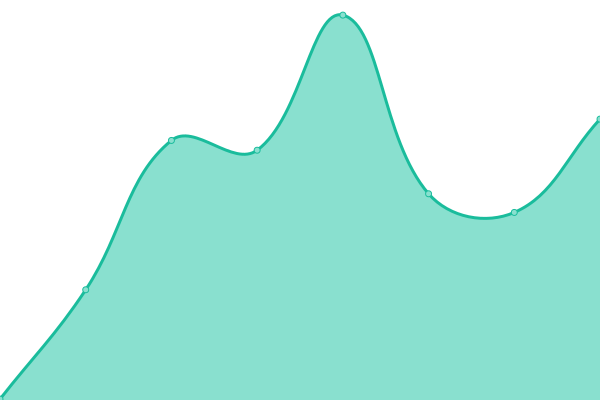
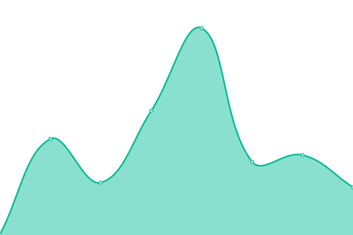
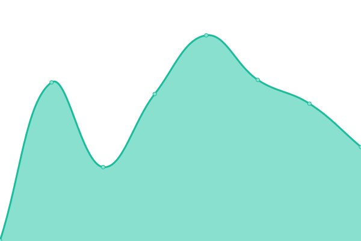

# [📈 Live Status](https://philstevenson.github.io/upptime): <!--live status--> **🟩 All systems operational**

Powered by [Upptime](https://github.com/upptime/upptime).

<!--start: status pages-->
<!-- This summary is generated by Upptime (https://github.com/upptime/upptime) -->
<!-- Do not edit this manually, your changes will be overwritten -->
<!-- prettier-ignore -->
| URL | Status | History | Response Time | Uptime |
| --- | ------ | ------- | ------------- | ------ |
|  [Vinny Farms](https://vinnyfarms.com) | 🟩 Up | [vinny-farms.yml](https://github.com/philstevenson/upptime/commits/HEAD/history/vinny-farms.yml) | 

 239ms
     
 | 

<a href="https://philstevenson.github.io/upptime/history/vinny-farms">100.00%</a>
    

|  [PhilStevenson.tech](https://philstevenson.tech) | 🟩 Up | [phil-stevenson-tech.yml](https://github.com/philstevenson/upptime/commits/HEAD/history/phil-stevenson-tech.yml) | 

 250ms
     
 | 

<a href="https://philstevenson.github.io/upptime/history/phil-stevenson-tech">100.00%</a>
    

|  [Discovery Property Services](https://discoverypropertyservices.co.uk) | 🟩 Up | [discovery-property-services.yml](https://github.com/philstevenson/upptime/commits/HEAD/history/discovery-property-services.yml) | 

 228ms
     
 | 

<a href="https://philstevenson.github.io/upptime/history/discovery-property-services">100.00%</a>
    

|  [Anderson Driver Training](https://www.andersondrivertraining.co.uk) | 🟩 Up | [anderson-driver-training.yml](https://github.com/philstevenson/upptime/commits/HEAD/history/anderson-driver-training.yml) | 

 362ms
     
 | 

<a href="https://philstevenson.github.io/upptime/history/anderson-driver-training">100.00%</a>
    

<!--end: status pages-->

[**Visit our status website →**](https://philstevenson.github.io/upptime)

## 📄 License

- Powered by: [Upptime](https://github.com/upptime/upptime)
- Code: [MIT](./LICENSE) © [Upptime](https://upptime.js.org)
- Data in the `./history` directory: [Open Database License](https://opendatacommons.org/licenses/odbl/1-0/)
